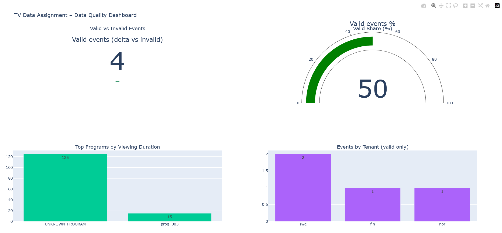

## Data Quality Dashboard & CI/CD


## Data Quality Dashboard (Live)



🔗 Live link:
https://eaguilera.github.io/Assignment_Telia/

------------------------------------------------------------------------

### Data Quality Dashboard (Plotly)

After running the Spark pipeline (`scripts/ingest_and_validate.py`) the following
artifacts are produced in `output/`:

- `enriched_events.parquet/` – enriched viewing events with program metadata.
- `validation_summary.json/` – JSON summary including counts and top programs.

The dashboard script reads these outputs and produces an interactive HTML file
with key data quality indicators, including:

- Total / valid / invalid events and valid ratio (%).
- Top 3 programs by total viewing duration.
- Event distribution per tenant (from enriched events).

**Usage**

```bash
python dashboard/generate_data_quality_dashboard.py \
  --summary-dir output/validation_summary.json \
  --enriched-parquet-dir output/enriched_events.parquet \
  --output-html output/data_quality_dashboard.html
  

